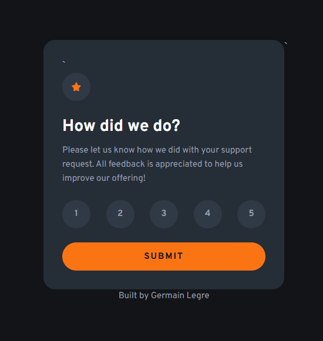

# Feedback card

## What it does

This project is a feedback card that allows a visitor to select a rating from 1 to 5. The card includes a rating form and a thank-you section that will be made interactive with JavaScript in a later lesson.

## Built with

* HTML5
* Accessible form controls
* Radio buttons
* Fieldset and legend
* CSS3
* Git and GitHub

## What I learned

I learned how radio buttons form a group using the same `name` attribute. I also practiced connecting labels to inputs, using `required`, organizing forms with `fieldset` and `legend`, and creating a Git repository inside an existing folder.

I also learned how the CSS `+` selector can style an element based on the element that comes immediately before it, such as using `input:checked + label` to style the selected rating.

## Live site

https://germlkg11-ctrl.github.io/feedback-card/

## Screenshot
 

